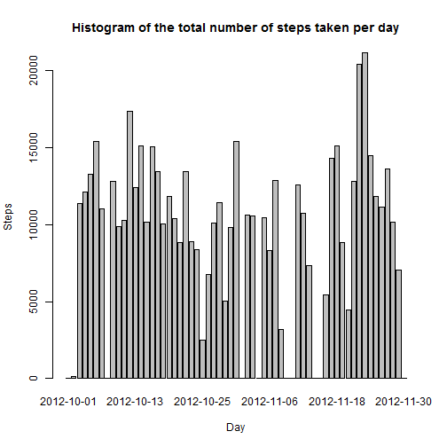
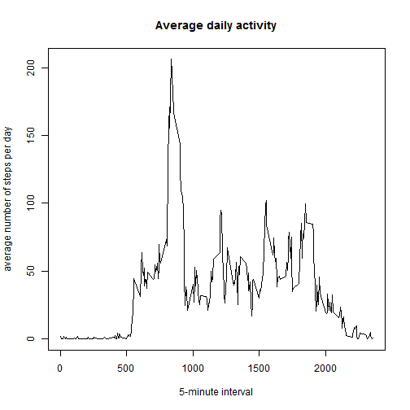
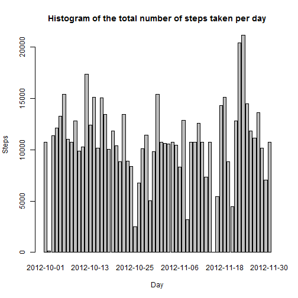
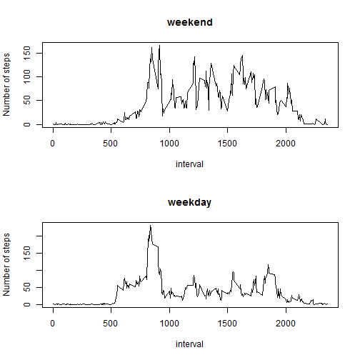

# Reproducible Research: Peer Assessment 1


## Loading and preprocessing the data

```r
setwd("C:/Users/HomeUser/Documents/Spécialité Data Science/Reproducible Research/repos")

data <- read.csv("./activity.csv")
data$date <- as.Date(data$date, "%Y-%m-%d")

head(data)
```

```
##   steps       date interval
## 1    NA 2012-10-01        0
## 2    NA 2012-10-01        5
## 3    NA 2012-10-01       10
## 4    NA 2012-10-01       15
## 5    NA 2012-10-01       20
## 6    NA 2012-10-01       25
```

```r
summary(data)
```

```
##      steps            date               interval   
##  Min.   :  0.0   Min.   :2012-10-01   Min.   :   0  
##  1st Qu.:  0.0   1st Qu.:2012-10-16   1st Qu.: 589  
##  Median :  0.0   Median :2012-10-31   Median :1178  
##  Mean   : 37.4   Mean   :2012-10-31   Mean   :1178  
##  3rd Qu.: 12.0   3rd Qu.:2012-11-15   3rd Qu.:1766  
##  Max.   :806.0   Max.   :2012-11-30   Max.   :2355  
##  NA's   :2304
```

## What is mean total number of steps taken per day?

```r
options(scipen = 1, digits = 2)  #get rid of exponential format

aggdata <- tapply(data$steps, data$date, sum, na.rm = T)
barplot(aggdata, names.arg = as.Date(names(aggdata)), main = "Histogram of the total number of steps taken per day", 
    ylab = "Steps", xlab = "Day")
```

 

```r

meansteps <- round(mean(aggdata))
mediansteps <- round(median(aggdata))
```

Mean total number of steps taken per day: 9354.

Median total number of steps taken per day: 10395.

## What is the average daily activity pattern?

```r
dailydata <- tapply(data$steps, data$interval, mean, na.rm = T)
plot(as.numeric(names(dailydata)), dailydata, type = "l", main = "Average daily activity", 
    xlab = "5-minute interval", ylab = "average number of steps per day")
```

 

```r
indmaxinterv = which(dailydata == max(dailydata))
maxinterv = names(dailydata[indmaxinterv])
```

Which 5-minute interval, on average across all the days in the dataset, contains the maximum number of steps? 835

## Imputing missing values

```r
nbna = sum(is.na(data))
print("Total number of missing values in the dataset: ")
```

```
## [1] "Total number of missing values in the dataset: "
```

```r
print(nbna)
```

```
## [1] 2304
```

```r

# Strategy: Use of the mean for that 5-minute interval, calculated early in
# dailydata
newdata <- data
indexes_na <- which(is.na(data$step))
newdata[indexes_na, ]$steps <- sapply(data[indexes_na, ]$interval, function(x) {
    dailydata[as.character(x)][[1]]
})

# check: first lines of newdata should contain average values corresponding
# to the interval considered
head(newdata)
```

```
##   steps       date interval
## 1 1.717 2012-10-01        0
## 2 0.340 2012-10-01        5
## 3 0.132 2012-10-01       10
## 4 0.151 2012-10-01       15
## 5 0.075 2012-10-01       20
## 6 2.094 2012-10-01       25
```

```r
dailydata[c(as.character(seq(0, 25, by = 5)))]
```

```
##     0     5    10    15    20    25 
## 1.717 0.340 0.132 0.151 0.075 2.094
```

```r

# Plot histogram
aggdata <- tapply(newdata$steps, newdata$date, sum, na.rm = T)
barplot(aggdata, names.arg = as.Date(names(aggdata)), main = "Histogram of the total number of steps taken per day", 
    ylab = "Steps", xlab = "Day")
```

 

```r

meansteps <- round(mean(aggdata))
mediansteps <- round(median(aggdata))
```

Mean total number of steps taken per day: 10766.

Median total number of steps taken per day: 10766.

Imputing missing values raises overall number of steps!

## Are there differences in activity patterns between weekdays and weekends?

```r
Sys.setlocale(category = "LC_ALL", locale = "C")
```

```
## [1] "C"
```

```r

newdata$week <- ifelse(weekdays(newdata$date) %in% c("Sunday", "Saturday"), 
    "weekend", "weekday")
newdata$week <- factor(newdata$week)

par(mfrow = c(2, 1))

newdailydataWE <- tapply(newdata[newdata$week == "weekend", ]$steps, newdata[newdata$week == 
    "weekend", ]$interval, mean, na.rm = T)
plot(as.numeric(names(newdailydataWE)), newdailydataWE, type = "l", main = "weekend", 
    xlab = "interval", ylab = "Number of steps")

newdailydataWD <- tapply(newdata[newdata$week == "weekday", ]$steps, newdata[newdata$week == 
    "weekday", ]$interval, mean, na.rm = T)
plot(as.numeric(names(newdailydataWD)), newdailydataWD, type = "l", main = "weekday", 
    xlab = "interval", ylab = "Number of steps")
```

 

```r

Sys.setlocale(category = "LC_ALL", locale = "")
```

```
## [1] "LC_COLLATE=French_France.1252;LC_CTYPE=French_France.1252;LC_MONETARY=French_France.1252;LC_NUMERIC=C;LC_TIME=French_France.1252"
```

